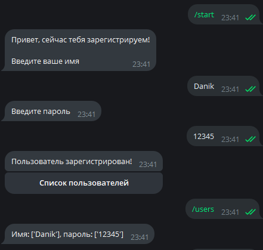

test_2 - реализованна добавление в БД имя и пароль, ура получилось 

run.py - Главная точка проекта
app/handlers - обработчики
app/keyboards - кнопки
Реализован Календарь по команде /calendar и др. /start /hlep

test.py - Реализованно при команде /start
и отправе имени пользователя,
добавление пользователя в БД

TEST/app_1/run_1.py - Вторая точка проекта
TEST/app_1/handlers/handlers - обработчики
TEST/app_1/keyboards/keyboards - кнопки

Структура проекта :

IT_Progress/
├── main.py                # Основной файл с инициализацией бота
├── handlers/             # Обработчики команд и сообщений
│   ├── __init__.py       # Инициализация пакета
│   ├── start.py          # Обработчик команды /start
│   ├── help.py           # Обработчик команды /help
│   └── other_handlers.py # Другие обработчики
├── middlewares/          # Промежуточные обработчики (middlewares)
│   └── __init__.py       # Инициализация пакета
├── keyboards/            # Клавиатуры
│   └── __init__.py       # Инициализация пакета
├── states/               # Состояния (если используете FSM)
│   └── __init__.py       # Инициализация пакета
├── services/             # Вспомогательные функции и сервисы
│   └── __init__.py       # Инициализация пакета
├── config.py             # Конфигурация (токены, настройки)
└── requirements.txt      # Зависимости проекта

Описание компонентов

main.py:

Это основной файл вашего бота. Здесь вы создаете экземпляр Bot и Dispatcher, 
настраиваете логирование и регистрируете обработчики.

handlers/:

В этом каталоге находятся файлы с обработчиками команд и сообщений.
Каждый файл может содержать обработчики для определенных команд или функциональности.
Например, в start.py можно реализовать обработчик для команды /start.
middlewares/:

Здесь вы можете разместить промежуточные обработчики (middleware), которые могут обрабатывать входящие сообщения до того, как они дойдут до ваших обработчиков.
Это может быть полезно для аутентификации, логирования или обработки ошибок.
keyboards/:

В этом каталоге можно хранить определения клавиатур (inline и reply).
Это позволяет легко управлять клавиатурами и использовать их в разных частях кода.
states/:

Если ваш бот использует состояния (например, с помощью FSM), здесь можно определить состояния и переходы между ними.
Это помогает управлять сложными взаимодействиями с пользователем.
services/:

В этом каталоге можно разместить вспомогательные функции или классы, которые могут использоваться в разных частях вашего бота.
Например, это могут быть функции для работы с базой данных или API.
config.py:

Этот файл содержит конфигурацию вашего бота, такую как токены, настройки базы данных и другие параметры.
Рекомендуется использовать переменные окружения для хранения чувствительных данных.
requirements.txt:

Этот файл содержит список зависимостей вашего проекта. Вы можете создать его с помощью команды pip freeze > requirements.txt.
Это позволяет другим разработчикам легко установить все необходимые библиотеки.
Пример реализации
Вот пример реализации некоторых из этих компонентов:

python
Копировать код
# config.py
import os

TOKEN = os.getenv("TELEGRAM_BOT_TOKEN")
python
Копировать код
# handlers/start.py
from aiogram import types

async def start_command(message: types.Message):
    await message.answer("Привет! Я бот.")

def register_handlers(dp):
    dp.register_message_handler(start_command, commands=['start'])
python
Копировать код
# keyboards/default.py
from aiogram.types import ReplyKeyboardMarkup, KeyboardButton

def get_default_keyboard():
    button1 = KeyboardButton("Кнопка 1")
    button2 = KeyboardButton("Кнопка 2")
    return ReplyKeyboardMarkup(resize_keyboard=True).add(button1).add(button2)
Заключение
Эта структура поможет вам организовать код вашего бота на Aiogram так, чтобы он был понятным и удобным для сопровождения. Вы можете адаптировать ее под свои нужды в зависимости от сложности проекта и функциональности бота.

